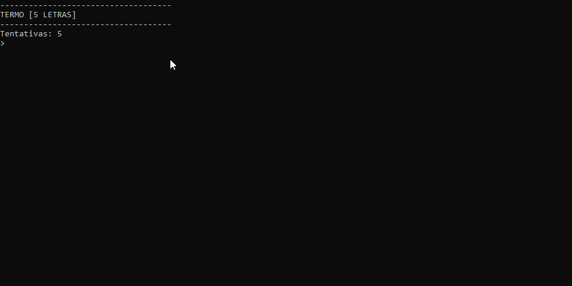

#  TERMO



## Introdução

Um jogo de adivinhaçao de palavras onde o usuario tem 5 chances de adivinhar uma palavra oculta

## Regras do jogo

O computador escolhe de maneira anonima uma palavra de uma lista feita para o jogo,o usuario chuta uma palavra para tentar acertar a palavra secreta,tendo 5 chances no total para faze-lo.O jogo da feedbacks visuais de acordo com o quao perto se esta de acertar a palavra.


O jogo acaba quando o usuario acertar a palavra ou quando ele erra as 5 tentativas.

## Funções

**- Geração de palavra aleatório:** o computador seleciona 1 palavra em uma lista montada para o jogo

**- Tratamento de erros:** o jogador só pode digitar letras e so são consideradas palavras validas aquelas de 5 letras.caso a digitação não esteja neste criterio nao sera considerada a tentativa,ao inves disso sera mostrada uma mensagem de erro e o usuario devera fornecer uma nova digitação

**- Feedback com cores:** ao digitar a palavra chutada,ela retorna com as letras em cores diferentes de acordo com quao perto se esta de acertar,sendo elas:
Verde:a letra existe na palavra e esta na posição correta.

Amarelo:a letra existe na palavra,mas esta na posição errada.

Vermelho:a letra não existe na palavra.


## Como ultilizar

1. Extraia o arquivo Termo.ConsoleApp do repositório com .zip;

2. Restaure as dependecias do projeto com o ```comando```:
```
dotnet restore
```
3. Agora va até o diretório raiz e execute no terminal com o ```comando```:
```
dotnet run --project  Termo.ConsoleApp
```

## Requisitos

.NET SDK (versão 10)